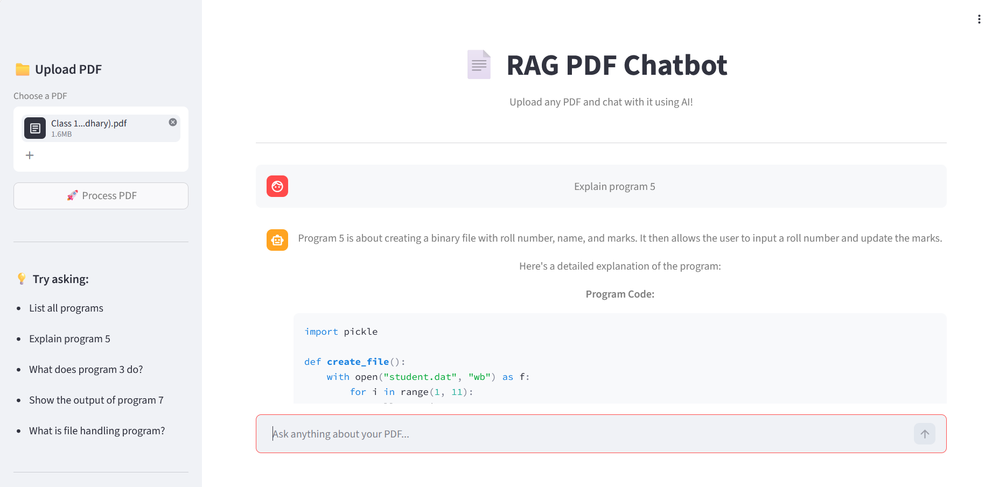
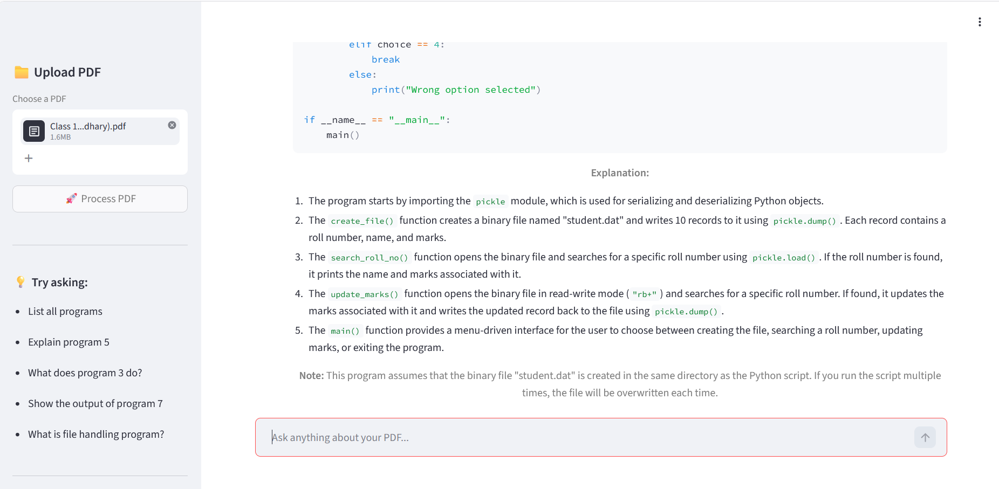

<div align="center"> 
 
# 📄💬 RAG PDF Chatbot

### Chat with any PDF — in plain English, grounded entirely in the document itself.

[](https://www.python.org/)
[](https://streamlit.io/)
[](https://groq.com/)
[](https://www.trychroma.com/)
[](#-license)



</div>

---

## ✨ What It Does

Upload any PDF — a textbook, lecture notes, a research paper, a contract — and ask it questions in plain English. The chatbot reads **only your document**, retrieves the most relevant passages, and asks Llama 3.1 to answer strictly from that context. No hallucinated facts, no generic web knowledge pretending to be your source material.

> Think of it as turning a static PDF into a conversation partner that actually read the thing.

---

## 🖼️ Demo

<div align="center">


</div>

---

## 🧠 How RAG Works Here

```
                 ┌─────────────┐
   PDF Upload →  │  PyMuPDF     │  Extracts raw text page-by-page
                 └──────┬───────┘
                        ▼
                 ┌─────────────┐
                 │  Chunking    │  Splits text into overlapping chunks
                 └──────┬───────┘
                        ▼
                 ┌─────────────────────┐
                 │ all-MiniLM-L6-v2     │  Embeds each chunk into a vector
                 └──────┬──────────────┘
                        ▼
                 ┌─────────────┐
                 │  ChromaDB    │  Stores & indexes embeddings
                 └──────┬───────┘
                        ▼
   Your Question →  Similarity search → top-k relevant chunks
                        ▼
                 ┌─────────────────────┐
                 │ Llama 3.1 8B (Groq)  │  Answers using only retrieved context
                 └──────┬──────────────┘
                        ▼
                    💬 Answer, grounded in your PDF
```

**Retrieval-Augmented Generation (RAG)** means the model never answers from memory alone — every response is anchored to text actually retrieved from your document, which keeps answers accurate and citable.

---

## 🛠️ Tech Stack

| Layer            | Tool                              |
|-------------------|------------------------------------|
| 🧩 LLM             | Llama 3.1 8B via Groq API         |
| 🗂️ Vector Database | ChromaDB                          |
| 🔢 Embeddings      | all-MiniLM-L6-v2 (HuggingFace)    |
| 📖 PDF Parsing     | PyMuPDF                           |
| 🎛️ UI              | Streamlit                         |
| 🌐 Tunneling       | pyngrok                           |
| 🔐 Config          | python-dotenv                     |

---

## 🚀 Getting Started

### Option A — Run in Google Colab (recommended, zero local setup)

1. Open the notebook in Colab and mount/clone this repo.
2. Install dependencies:
   ```bash
   pip install -r requirements.txt
   ```
3. Add your Groq API key to a `.env` file (or Colab secrets):
   ```
   GROQ_API_KEY=your_key_here
   ```
4. Launch the Streamlit app and tunnel it out with `pyngrok`:
   ```python
   from pyngrok import ngrok
   public_url = ngrok.connect(8501)
   print(public_url)
   ```
   ```bash
   streamlit run app/main.py &
   ```
5. Open the printed ngrok URL and start chatting with your PDF. 🎉

### Option B — Run locally

```bash
git clone https://github.com/Ansh-san/rag-pdf-chatbot.git
cd rag-pdf-chatbot
pip install -r requirements.txt
echo "GROQ_API_KEY=your_key_here" > .env
streamlit run app/main.py
```

Then open `http://localhost:8501` in your browser.

---

## 📁 Project Structure

```
rag-pdf-chatbot/
├── app/               # Streamlit UI
├── src/               # RAG pipeline: parsing, chunking, embeddings, retrieval
├── requirements.txt
└── .gitignore
```

---

## 🗺️ Roadmap

- [ ] Multi-PDF chat (query across a whole document set)
- [ ] Source-passage highlighting in answers
- [ ] Swap-in support for other LLM providers
- [ ] Chat history persistence

---

## 📜 License

Released under the MIT License — free to use, modify, and share.

---

<div align="center">

Built with ❤️ by [Ansh-san](https://github.com/Ansh-san)

</div>
